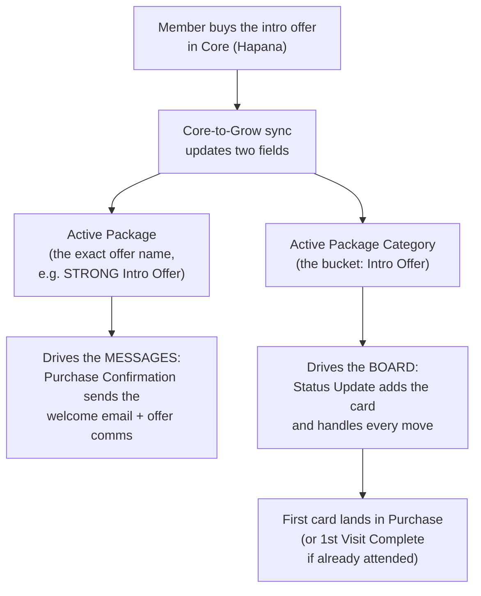
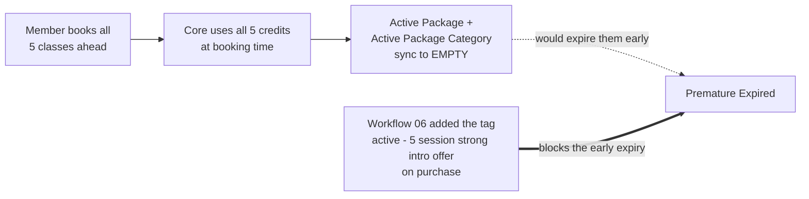
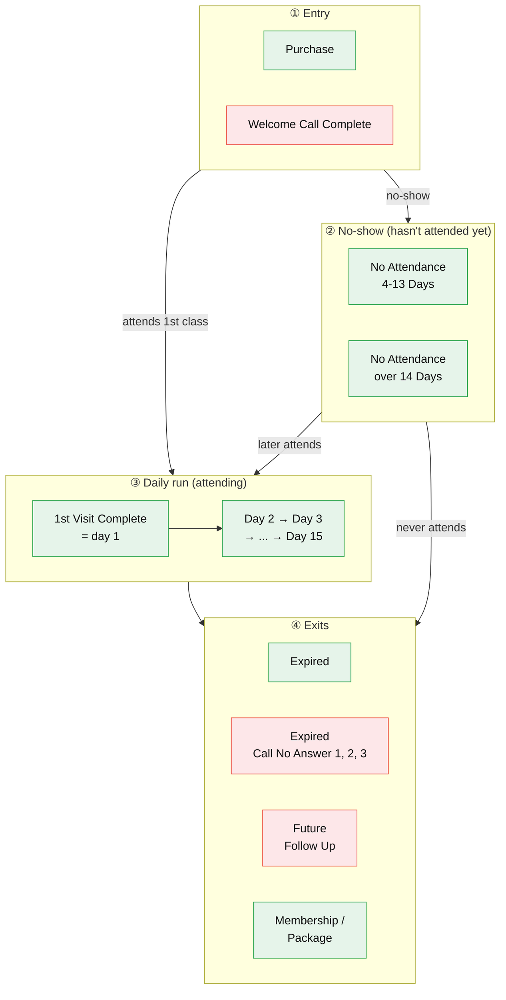
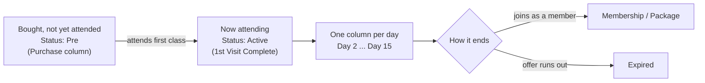
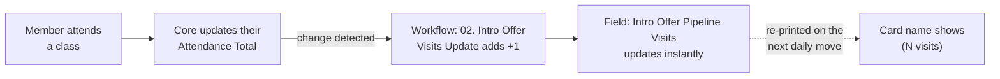
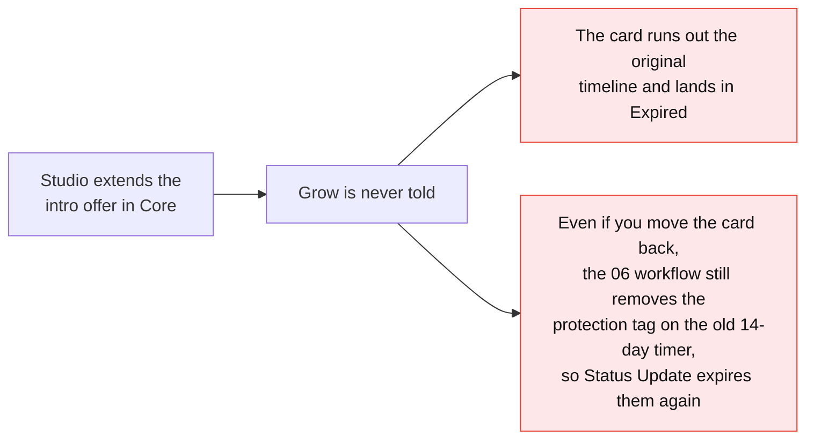

# Intro Offer Pipeline — Training Rewrite (Draft for Review)

> **Status:** draft for Mario's red-pen. Nothing here has touched the live pages yet.
> **Verified:** Sunday, 21 June 2026, against the live STRONG Grow template account (`cGie31g8caN2HkP6vN2P`). Every column name, field name, and workflow behaviour below was pulled from the live pipeline and the actual workflow node graphs, not from the old pages.
> **Covers two pages:** *New Intro Offers* (how a member gets onto the board) and *During Intro Offer* (the journey across the board, and how to read it).
> **Scope:** the current live STRONG Intro Offer product only. Older variants (STRONG Experience, UK, 5-for-$50) and the Days 16-21 extension are out of scope for this draft.

---

## Who this is for

You have never opened Grow before. By the end of these two pages you will understand the Intro Offer pipeline the way you understand a whiteboard: what each column means, which cards move on their own, which cards you move by hand, and why the numbers sometimes look off.

One thing to know up front. **The Intro Offer pipeline ships switched off.** On a brand-new studio it sits dormant until opening day, when it gets switched on as part of your studio's setup. So if you are reading this before you open, the automation described here is not running yet. That is by design.

---

# Page 1 — New Intro Offers

*How a member gets onto the board.*

## What the Intro Offer pipeline is

The Intro Offer pipeline is the board in Grow that tracks every member on the 5-session intro offer, from the moment they buy to the moment they either join as a member or let the offer lapse.

It is a visual dashboard and an automation engine at the same time. You read it like a board. Behind the scenes, a set of workflows moves most of the cards for you.

## How a member lands on the board

Nobody adds a member to the board by hand. A purchase in Core does it, by updating **two** fields that then do **two different jobs**. Getting these two fields straight is the most important thing on this page.

Here is the chain in plain words:

1. The member buys the intro offer in Core.
2. The Core-to-Grow sync updates two fields on their contact: **Active Package** (the exact offer they bought, such as "STRONG Intro Offer") and **Active Package Category** (the bucket it sits in, "Intro Offer").
3. Those two fields drive two different things, and this is the part to remember:
   - **Active Package drives the communications.** The **01. STRONG Intro Offer Purchase Confirmation** workflow watches this field and sends the welcome email and the messages specific to that offer.
   - **Active Package Category drives the pipeline.** The **01. Intro Offer Status Update** workflow watches this field, uses it to add the card to the board, and later uses it again to move the member to **Expired** (when the category empties) or to **Membership/Package** (when the category changes to one of those).
4. The result on a fresh purchase: a first card in the **Purchase** column, status **Pre** (bought, not yet attended), visit count **0**, tagged into the pipeline.

If the member has somehow already attended a class by the time this runs, they skip straight to the **1st Visit Complete** column instead.

> **The two fields to keep straight.** *Active Package* is the exact offer name, and it decides **what messages go out**. *Active Package Category* is the bucket, and it decides **where the card goes on the board**. Every pipeline move (added in, sent to Expired, sent to Memberships or Packages) keys off the **Category**, never the package name.

### A Core quirk: a package can empty *before* a member attends

This one trips studios up, so it is worth understanding properly.

The 5-session intro offer is credit-based, and Core uses up a credit the moment a class is **booked**, not when it is attended. So a member who books all five classes up front uses all five credits straight away. Core then syncs their **Active Package** and **Active Package Category** to **empty**, even though they have not set foot in the studio yet.

Left alone, that empty Category would tell the Status Update workflow to move them to **Expired** far too early. That is exactly why the **06. STRONG Intro Offer** workflow exists.

On purchase, workflow 06 adds the tag `active - 5 session strong intro offer`. While that tag is on the contact, the empty Category cannot expire them. The tag is only removed once **14 days have passed from their first visit** or **they have completed 5 classes**, whichever comes first. So a member who books ahead stays protected for the full intro window instead of being expired the day they finish booking.

## The welcome beat

As the card is created, the member gets the human touch:

- An email: **"You're in. Let's Get STRONG."** confirming the purchase and pointing them to booking.
- A task lands for your team: **Welcome Call**, prompting someone to call and help them book their first class.

That welcome call is the first thing on the board that *you* drive. More on that on the next page.

## Then the journey begins

Once the card exists and the welcome sequence has sent, the member starts moving through the board one step at a time. That day-by-day journey, and the columns you move by hand, is the next page.

---

# Page 2 — During Intro Offer

*The journey across the board, and how to read it.*

## The board at a glance

The Intro Offer board has 25 columns. That sounds like a lot, but they fall into four simple groups, and most of them move on their own.

Most members go Purchase, then 1st Visit Complete, then the daily run. A member who has not attended yet waits in the No Attendance columns and joins the daily run the moment they come in. The columns sit on the board in this same order, left to right, so 1st Visit Complete is the start of the daily run, not an entry column.

**Green columns move on their own. Red columns are yours to move by hand.**

| Group | Columns | Who moves the card |
|---|---|---|
| Entry | Purchase, **Welcome Call Complete** | Automatic, except **Welcome Call Complete** |
| No-show | No Attendance 4-13 Days, No Attendance over 14 Days | Automatic |
| Daily run | 1st Visit Complete (day 1), Day 2 through Day 15 | Automatic |
| Exits | Expired, **Expired Call No Answer 1/2/3**, **Future Follow Up**, Membership/Package | Automatic, except the **Call No Answer** and **Future Follow Up** columns |

## The member's journey across the board

A member's path through the board is simple once you see it:

- A new buyer sits in **Purchase** with the status **Pre**.
- The moment they attend their first class, they flip to **Active** and the card moves to **1st Visit Complete**. (There is no "Day 1" column. 1st Visit Complete *is* day one.)
- From there the card moves one column per day: Day 2, Day 3, and so on to Day 15.
- It ends one of three ways: they join (Membership/Package), the offer runs out (Expired), or your team parks them for later.

## What moves itself, and what you move

This is the part studios get wrong most often, so it is worth being precise.

**Automatic.** Each daily move has its own workflow that fires the moment a card lands in a column. It waits about a day, checks whether the member has joined or let the offer lapse, then pushes the card to the next column. You do not touch these. The day-by-day march from 1st Visit Complete down to Day 15 runs itself.

**You move these by hand.** Four columns track something the system simply cannot see, so a human has to move the card:

| Column you move | When you move it |
|---|---|
| **Welcome Call Complete** | After you have actually completed the welcome call. Grow has no way to know the call happened. |
| **Expired Call No Answer 1, 2, 3** | As you work through your expired-member call attempts and nobody picks up. Each no-answer is a manual step. |
| **Future Follow Up** | When you decide to park a member to follow up later. That is a judgement call, so it is a manual move. |

The rule of thumb: **if the card depends on a human action (a call made, a call answered, a decision to wait), you move it. Everything else moves itself.**

## Where the visit number on the card comes from

Every card shows the member's name and a visit count, like **"Sarah (3 visits) - STRONG Intro Offer."** Here is exactly where that number comes from, because it is the source of the most common confusion.

The workflow that drives this is **02. Intro Offer Visits Update**. Every time the member's attendance changes, it adds 1 to their **Intro Offer Pipeline Visits** count.

But notice the dotted line. The **field** updates the instant a class is attended. The **card name** only re-prints that number when a workflow next re-writes the card, which after the first visit happens on the next daily move. So the field is always current, and the card name catches up roughly once a day.

## Core vs Grow: read this before you trust a number

Two numbers look similar and get mixed up constantly. They come from different places.

| Number | Where it comes from | What it means |
|---|---|---|
| **Attendance Total** | **Core** (Hapana) | The real count of classes attended. This is the source of truth. |
| **Intro Offer Pipeline Visits** | **Grow**, not Core | A tally that Grow adds 1 to every time Attendance Total *changes*. It is a copy-kept-by-counting, not the real count. |

Why this matters: because Pipeline Visits is counted by Grow rather than read from Core, it can drift. The workflow adds 1 whenever Attendance Total *changes*, not only when it goes up. So if Core re-syncs and nudges the value, Grow can add an extra visit. **When the two disagree, Attendance Total from Core is the one to believe.**

## When a card looks wrong: the Pipeline Fix

There is a repair workflow built for exactly this: **202510 Intro Offer Pipeline Fix**. It recalculates which column a member should be in from their real **Intro Offer Purchase Date** and **Intro Offer First Visit Date**, then puts the card where it belongs.

To run it on a member whose card has gone wrong: add the tag **`intro offer fix`** to their contact. The workflow does the rest.

## When a member's intro offer gets extended

Sometimes a studio extends a member's intro in Core to give them more time. Core does not tell Grow, and the Grow automation is built around the member's **original** purchase and first-visit dates plus a fixed 14-day tag timer. So an extension has to be handled by hand, or the member gets wrongly expired. This is one of the few cases where you have to step in.

Two things go wrong if it is left alone:

**What to do when an intro gets extended.** Three steps, all manual:

1. **Move the card to the right day.** Work out how many days are left on the extended offer, and move the card to the Day column that lines up with that, so the daily run carries them to Day 15 right as the extended offer actually ends.
2. **Take them out of the tag workflow.** Remove the contact from the **06. STRONG Intro Offer** workflow (the one that adds, and later removes, the `active - 5 session strong intro offer` tag). This stops the tag being removed early on the original 14-day timer, which is what would otherwise re-expire them.
3. **Set a task to remove the tag yourself.** Create a task dated to the new, extended expiry. On that day, remove the `active - 5 session strong intro offer` tag by hand. That is what tells the pipeline they have genuinely reached the end, and lets the normal expiry run.

> **Why all three.** Step 1 keeps the board accurate. Step 2 stops the automation expiring them early. Step 3 makes sure they still expire at the right time once the extension is genuinely over. Skip step 2 and the tag removal re-expires them. Skip step 3 and they never expire at all.

## FAQ

Questions about how the pipeline is meant to work.

**How long does it take for a purchase in Core to show up in Grow?**
Usually 15 to 30 minutes. The Core-to-Grow sync is not instant, so when a member buys you will not see them on the board straight away. If Core has not validated the member's phone number yet, it can take a little longer, but it should never be more than an hour. If it has been over an hour, treat it as a fault and see Troubleshooting below.

**Why is the visit number in the member's profile different from the number on their card?**
They are two separate stores. The profile field (Intro Offer Pipeline Visits) updates the moment a class is attended. The card name is a text label that only re-prints the number when a workflow re-writes the card, which after the first visit happens about once a day. Attend a class this morning and the field jumps straight away, but the card still shows the earlier number until that day's move runs. (The card carries only one true field of its own, Last Call Date. Everything else you see on it, the visits and the offer name, is baked into the card's name when it was last written.)

**Why are there two visit fields, Intro Offer Pipeline Visits and STRONG Intro Offer Visits?**
Both count the same thing and move together. The card name uses Intro Offer Pipeline Visits.

**A member has used up all their classes, or their package shows empty, but they are still active in the pipeline. Why?**
Because the 5-session offer uses a credit when a class is **booked**, not when it is attended. A member who books all five classes ahead empties their package straight away, even before attending. The `active - 5 session strong intro offer` tag (added on purchase by the 06. STRONG Intro Offer workflow) keeps them protected in the pipeline until 14 days from their first visit or 5 completed classes, so they are not expired early just for booking ahead.

**A card is sitting in a column and nothing is moving it. Is it stuck?**
Probably not. Check whether it is one of the four hand-moved columns: Welcome Call Complete, the three Expired Call No Answer columns, or Future Follow Up. Those never move on their own. They are waiting for you.

## Troubleshooting

When something looks wrong, start here. Each one is a real cause we have seen, written out in full so you can fix it from this page without going hunting. (These are the same causes collected on the Pipeline Inaccuracy page. They are repeated here on purpose, because this is where you will actually be looking.)

### A member purchased, but they are not showing in Grow at all

**What's happening.** Two common causes, in order of likelihood:

1. **The sync has not run yet.** Core to Grow takes 15 to 30 minutes, and up to an hour if the member's phone number is not validated in Core. Most "missing" members are just early.
2. **The package was set up in Core with the wrong Package Category.** A member only enters the Intro Offer pipeline when their Active Package Category reads **Intro Offer** or **Intro Offers**. If the package was created under a different category by mistake, the sync still brings the contact across, but the Status Update workflow never adds them to the board. This has happened in the US by accident.

**How to fix.** If it has been under an hour, wait. If it has been longer, open the member in Core and check the package's Category. Correct it to Intro Offer (or Intro Offers), and the next sync will place them on the board.

### A member is on the board, but they never got the welcome email or any nurture

**What's happening.** The board and the messages run off two different fields, the same split from the top of these pages. A card lands on the board whenever the **Active Package Category** is Intro Offer or Intro Offers, whatever the package is called. But the post-purchase automations (the welcome email, the nurture sequence, the check-in SMS, and the upsells) only fire when the **Active Package name** matches what those workflows look for, such as "STRONG Intro Offer" or "7 Classes for". So a studio running an intro offer under its own custom name will see those members appear on the board correctly, but get none of the messaging.

**Watch out.** The protection tag keys off the package name too, so a custom-named offer also misses it. That means the booking-ahead safeguard does not apply, and the member can be expired early once they book all their classes (see "A Core quirk: a package can empty before a member attends" earlier in this guide).

**How to fix.** The automations have to be custom-built for that package name: the welcome, nurture, milestone, and tag workflows cloned and pointed at the new name. That is an HQ build, so flag it to HQ with the studio and the exact package name. The simpler option, if the studio is willing, is to use one of the standard intro offer names in Core so the existing automations match. Until either is done, the studio handles the welcome and follow-up for those members by hand.

### The day counter started on the wrong day, or a free class already moved them to 1st Visit Complete

**What's happening.** Grow cannot tell a free class apart from a paid intro class. Any attended class moves the member's Attendance Total, which fires the Visits Update workflow, flips them from Pre to Active, and anchors the day counter to that class's date. So a member who did a free STRONG Starter class, or an old casual drop-in from months ago, can be moved to 1st Visit Complete with the counter on the wrong date, before they have used a single intro credit.

**How to check.** In Core, open the member's profile.

- Payments tab (the 4th icon): find the intro offer package, note its Begin Date, and open Visits History to see every booked class.
- Schedule tab (the 3rd icon): open Past Sessions and filter the dates to see every attended class, including free ones.
- If a class shows in Past Sessions but not in the package's Visits History, it was a free class. If its date is before the package Begin Date, it started the counter early.

**How to fix.** Move the card back to where the member actually is: back to Purchase if they have not started their paid offer, or the correct Day column if they have. Set Intro Offer Pipeline Visits to the real number, and correct the **Intro Offer First Visit Date** field to their actual first paid visit. Once those dates are right, you can add the `intro offer fix` tag to let the Pipeline Fix re-place the card from the corrected dates. There is no permanent prevention: the Core-to-Grow sync does not say whether a class was free or paid, so this has to be caught by hand.

### Pipeline Visits is higher than the classes the member actually attended

**What's happening.** Pipeline Visits is a Grow tally, not a copy of Core. The Visits Update workflow adds 1 every time Attendance Total **changes**, not only when it goes up. Core syncs many times a day and can push a value that bounces (for example 1, then 2, then 1, then 2), and each change adds another visit, so the count inflates past the real attendance.

**Why it matters.** When Pipeline Visits reaches 5, the protection tag `active - 5 session strong intro offer` is removed. If the count is inflated, the tag comes off before the member has truly done 5 classes, and with the tag gone the Status Update workflow sees the empty package and moves them to Expired with sessions still left.

**How to check.** Compare Grow's Pipeline Visits (in the Intro Offer Information section on the contact) against the real attendance count in Core's Visits History. To confirm the cause, open Grow Settings, then Audit Logs, search the contact, and look at Attendance Total across the Integration syncs. Fluctuating values with Pipeline Visits ticking up each time is the inflation.

**How to fix.** Correct the Pipeline Visits field to the real attendance count. If the protection tag was already removed, re-add `active - 5 session strong intro offer` and move the card back to the correct day. If you see this across several members at one location, the studio's Core sync may be misconfigured, so flag it to HQ with the contact IDs and audit-log screenshots.

### A member who never attended is suddenly running the full nurture sequence

**What's happening.** This is almost always a contact merge. When two records for one person are merged in Grow (through Bulk Actions), the merge fires field-change events. If the surviving record inherits an Attendance Total above 0 from the old record, the Visits Update workflow fires, sees status Pre with attendance above 0, and flips them to Active with 1 visit. That cascades into 1st Visit Complete and the whole 15-day nurture, even though they have zero bookings on their current offer.

**How to check.** In Grow Audit Logs, search the contact around when it went wrong and look for "Updated (Contact Merge)" with source BULK_ACTION, followed within seconds by a cascade of status change, visit update, tag, and card-move entries. Confirm in Core that they have zero bookings on the current package.

**How to fix.** Reset the pipeline position by hand: move the card back to Purchase, set Pipeline Visits to 0, set Intro Offer Pipeline Status to Pre, and remove any tags the false activation added. Going forward, check with HQ before merging contacts who are on an active intro offer, since the merge itself is what triggers this.

### A member bought, but they are still getting lead nurture and never showed as Sold in the Leads Pipeline

**What's happening.** This is two contacts for one person. If they opted in with one email and purchased with a different email, Core creates a second contact for the purchase. Grow now holds two records with the same name and different email addresses: the opt-in record stays in the Leads Pipeline being nurtured, while the purchase record runs the Intro Offer pipeline on its own.

**How to fix.** Merge the two contacts in Grow so the purchase and the lead history live on one record. If the member is mid-intro-offer, treat it like the contact-merge case above: the merge can re-fire the visit workflows on a record that already has attendance, so flag it first and be ready to reset the pipeline position afterwards.

## Reference: which workflow moves a card into each column

This is the precise map for tracing what put a member where they are. You do not need it day to day. (Verified from the live template workflows. Every workflow here is a draft on the template and runs live once the studio is switched on, except the Pipeline Fix, which is always on.)

| Column | What moves a card into it |
|---|---|
| Purchase | **01. Status Update** and **01. Purchase Confirmation**, on the Core purchase |
| 1st Visit Complete | **02. Visits Update**, on the first attended class (or Status Update / Purchase Confirmation if they had already attended) |
| Day 2 | **Day 01 > Day 2** |
| Day 3 | **Day 02 > Day 3** |
| Day 4 through Day 14 | the matching workflow: **Day 03 > Day 4** writes Day 4, on up to **Day 13 > Day 14** writes Day 14 |
| Day 15 | **Day 14 > Day 15** |
| No Attendance [4-13 Days] and [>14 Days] | **03. False Starter Check** |
| Expired | whichever step detects the offer has ended: **01. Status Update**, or the active **Day** workflow's expiry branch |
| Membership/Package | whichever step detects they converted: **01. Status Update**, **05. Mark as Sold**, or **07. Marked Won** |
| Welcome Call Complete | nobody. You move it by hand. |
| Expired (Call No Answer 1, 2, 3) | nobody. You move it by hand. |
| Future Follow Up | nobody. You move it by hand. |

Two things to read alongside the table:

- **Each "Day A > Day B" workflow is named for exactly what it does.** It is triggered when the card arrives in column A, waits about a day, then writes the card into column B. So "Day 01 > Day 2" fires when the card reaches its day-one spot (1st Visit Complete) and moves it into Day 2. That is how the run advances itself, one column a day.
- **The 202510 Pipeline Fix can write a card into almost any column.** It is the reconciler. When you add the `intro offer fix` tag, it recomputes the right column from the real Purchase and First Visit dates and places the card there, which is why it sits behind nearly every row above.

### What starts each of these workflows

The movers above are kicked off by one of these:

| What changes or happens | Workflow it starts |
|---|---|
| Active Package Category changes | 01. Intro Offer Status Update |
| Active Package changes | 01. Purchase Confirmation, and 06. the protection-tag workflow |
| Attendance Total changes | 02. Intro Offer Visits Update |
| A card arrives in a Day column | the next Day workflow |
| `intro offer fix` tag added | 202510 Pipeline Fix |
| `active - 5 session strong intro offer` tag removed | 01. Status Update (re-checks, and can expire them) |
